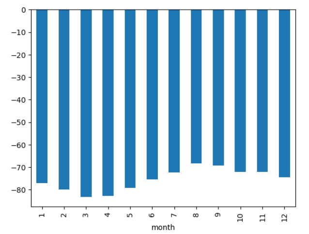

# Mission-to-Mars

## Overview
SpaceForward is an aerospace company with an ambitious goal of researching resource extraction from nearby planets. The current project involves analyzing information about the climate of Mars and news items related to Mars missions. This information is publicly available on websites, and to collect it efficiently, we used webscraping techniques to automate the process.

 

